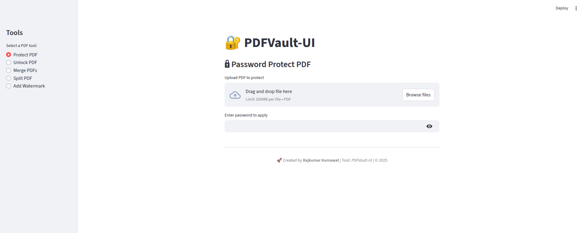
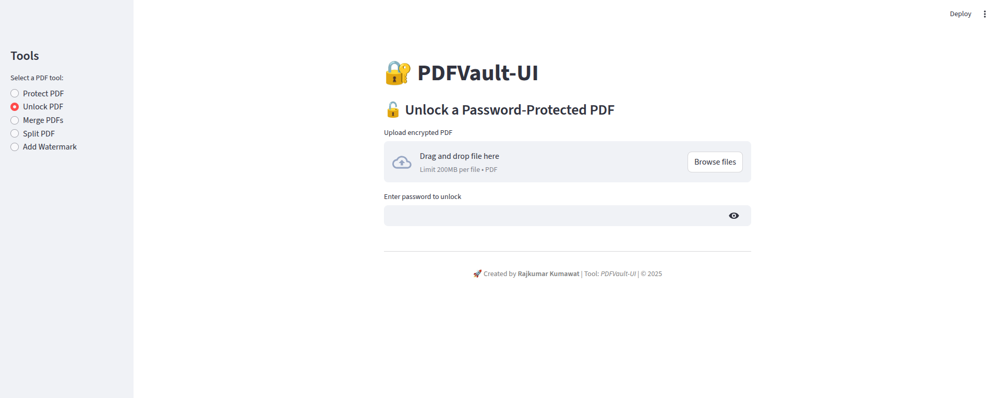
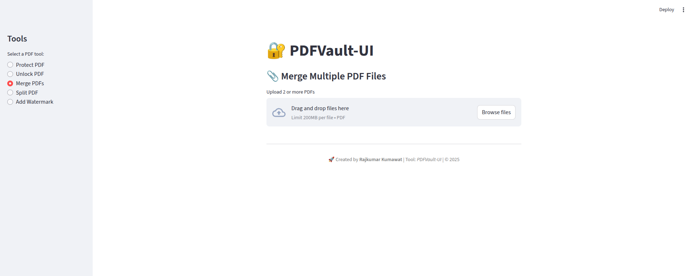
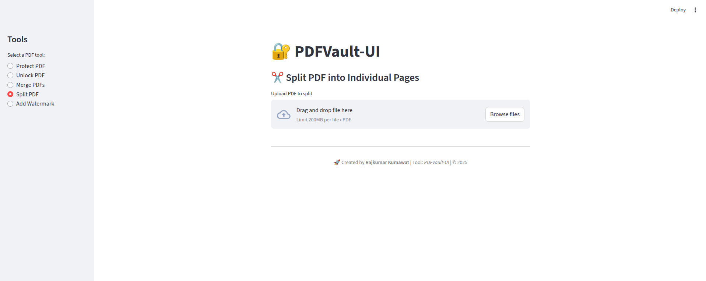
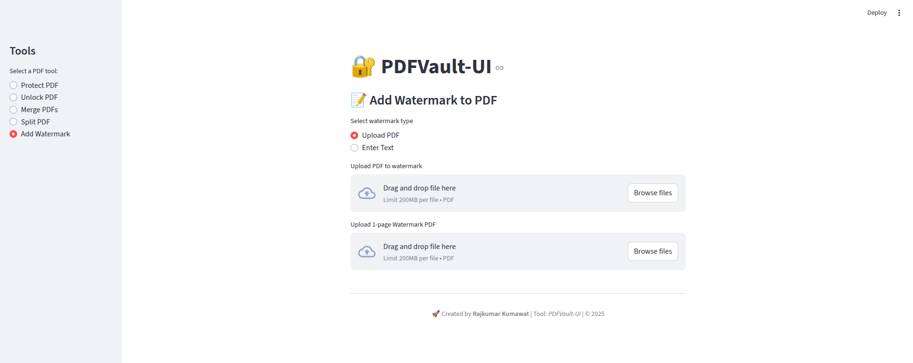

# 🔐 PDFVault-UI

> 🎯 **All-in-One PDF Utility Toolkit**  
> 🔧 Built with Streamlit — No installations, no hassle.  
> ✨ Developed by **Rajkumar Kumawat**

---

## 🚀 What is PDFVault-UI?

**PDFVault-UI** is an advanced yet simple open-source web application designed to handle common PDF tasks in one beautiful interface.

Whether you're protecting sensitive documents or adding watermark branding — PDFVault-UI does it all **securely and offline**.

---

## 🧰 Tools & Functionalities

| Tool            | Description                                                   |
|-----------------|---------------------------------------------------------------|
| 🔒 Protect PDF  | Add password protection to your PDF                           |
| 🔓 Unlock PDF   | Remove password using the correct key                         |
| 📎 Merge PDFs   | Combine multiple PDFs into one clean document                 |
| ✂️ Split PDF    | Separate each page into a new PDF file                        |
| 📝 Watermark PDF| Add watermark from text OR a 1-page PDF                       |

---

## 📸 UI Screenshots

### 🔒 Protect PDF  


### 🔓 Unlock PDF  


### 📎 Merge PDFs  


### ✂️ Split PDF  


### 📝 Add Watermark  


---

## 📦 Installation (Local Use)

```bash
git clone https://github.com/Rjkumarkumawat/pdfvault-ui.git
cd pdfvault-ui
pip install -r requirements.txt
streamlit run app.py
 
````

Then open [http://localhost:8501](http://localhost:8501) in your browser.

---

## 📁 Project Structure

```
pdfvault-ui/
├── app.py                  # Streamlit UI interface
├── requirements.txt        # Python dependencies
└── modules/                # Core logic for all PDF functions
    ├── protector.py
    ├── unlocker.py
    ├── merger.py
    ├── splitter.py
    └── watermarker.py
```

---

## 🌐 Online Deployment (Optional)

Soon, you can deploy **PDFVault-UI** on:

* [Streamlit Cloud](https://streamlit.io/cloud)
* [Render](https://render.com/)
* [Fly.io](https://fly.io/)

📌 Just upload this repo, and set `app.py` as entry point.

---

## 🧪 Powered By

* [Streamlit](https://streamlit.io/) for frontend
* [PyPDF2](https://github.com/py-pdf/pypdf) for PDF manipulation
* [ReportLab](https://www.reportlab.com/) for generating text-based watermarks

---

## 👨‍💻 Author

**Rajkumar Kumawat**

* 🔗 [LinkedIn](https://www.linkedin.com/in/rajkumar-kumawat-66072b199/)
* 🐙 [GitHub](https://github.com/Rjkumarkumawat)
* 📧 [rajkumarkumawat.workup@gmail.com](mailto:rajkumarkumawat.workup@gmail.com)

---

## ⭐ Support

If you find this project useful:

* Give it a ⭐ on GitHub
* Share it with friends or colleagues
* Contribute via pull requests

> ❤️ Made with care by Rajkumar Kumawat

```


